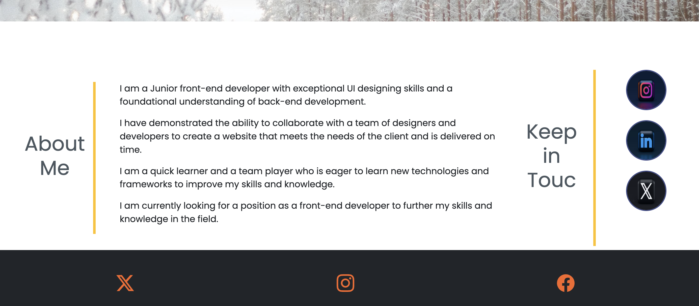

# Bootstrap-portfolio

## Description

This is a portfolio website that I created using Bootstrap. It is a responsive website that will display properly on any screen size. It contains a navbar, Work section,About me Section and contact me section along with responsive images.
I used the Bootstrap grid system to create a responsive layout for the website on about me section.

I used the google fonts and bootstrap Icons to style the website.
these are the screenshots of the website:

## Installation

To install this project, simply clone the repository and open the index.html file in your browser.

## Usage

This project can be used as a template for a portfolio website. Simply change the text and images to fit your needs.

## Credits

This project was created by me, but I would like to thank the EDX Bootcamp for providing me  the skills to create this project.

## License

MIT License

## Badges

N/A

## Tests

There are no tests for this project.

## Questions

If you have any questions, please contact me at the email address below.
niroshisugathadasa@gmail.com

## Contact Information

GitHub Username: Lotusniro

